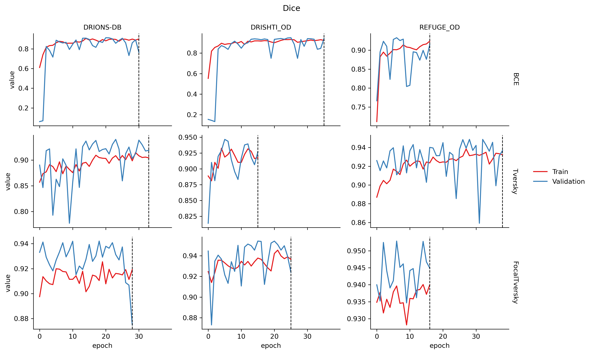
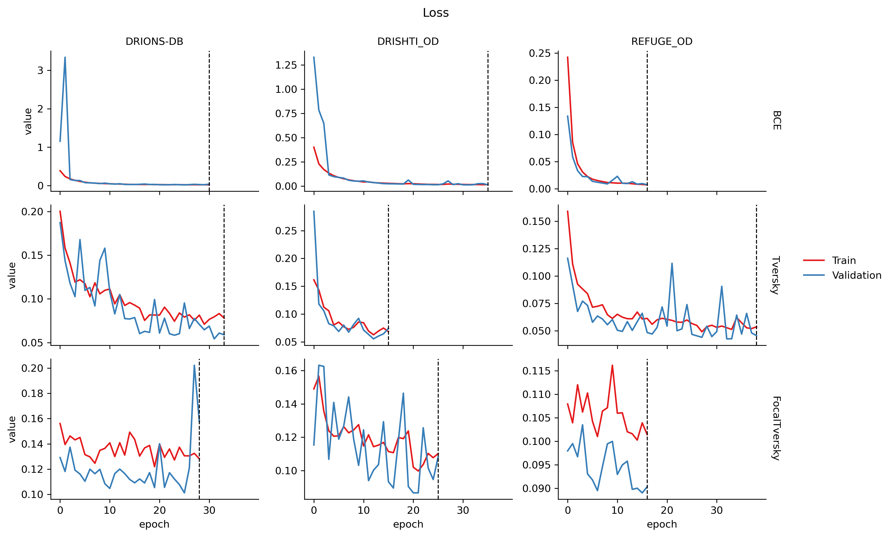
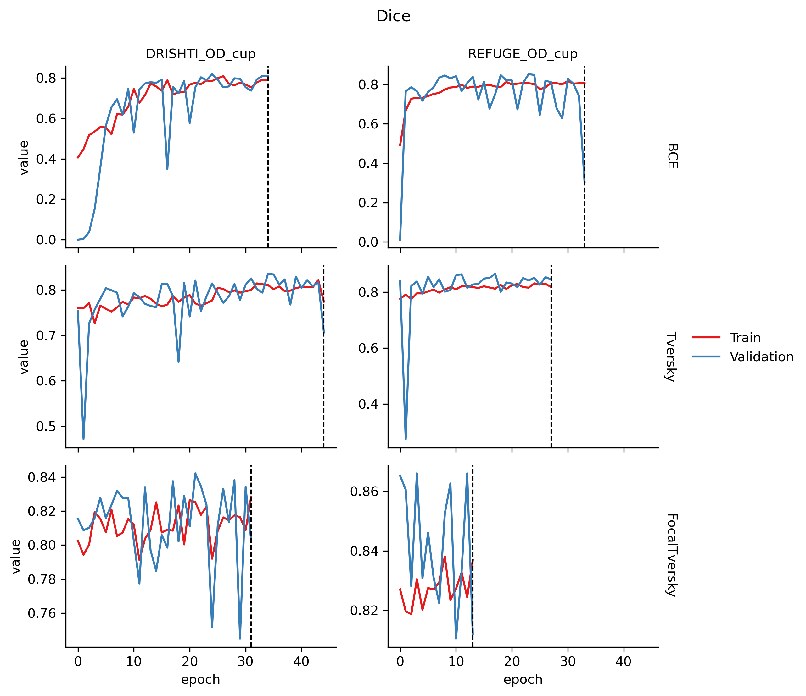
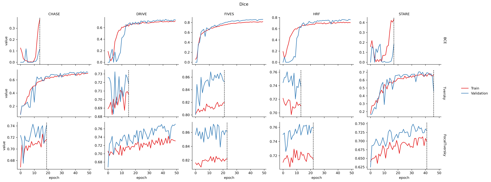
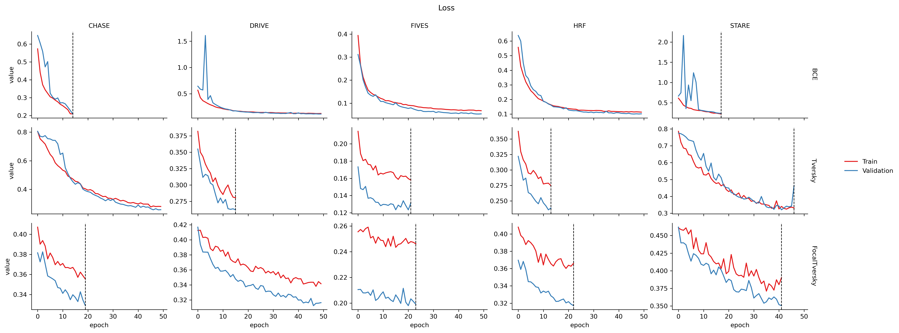

# Multi stage attention U-Net for fundus imaging segmentation
# Introduction
Fundus imaging segmentation plays a key role during ophthalmic diseases diagnosis. While manually segmentation is a time-consuming task and demands a specialist, in the last years an undefined number of works have been developed to automatically identify ocular structures and speed this task.

Here I propose a multi-stage and multi-task attention U-Net for vessel, optic disc and optic disc cup segmentation in fundus images. It a 3-train stage model, each with a different loss function (BCE, Tversky and FocalTversky). This approach aims progressive learning and better generalization to improve the segmentation quality. 

The model was tested in the following well stablished datasets: 

- Optic disc: [DRIONS-DB](https://www.sciencedirect.com/science/article/pii/S0933365708000547), [Drishti](https://ieeexplore.ieee.org/abstract/document/6867807) and [REFUGE](https://www.sciencedirect.com/science/article/pii/S1361841519301100).
- Optic dis cup: Drishti and REFUGE (same references of optic disc cup).
- Vessels: [CHASE](https://ieeexplore.ieee.org/document/6224174), [DRIVE](https://ieeexplore.ieee.org/abstract/document/845178), [FIVES](https://www.nature.com/articles/s41597-022-01564-3), [HRF](https://www5.cs.fau.de/research/data/fundus-images/) and [STARE](https://ieeexplore.ieee.org/abstract/document/845178).

These datasets were split in train and test datasets and individually trained during 50 epochs. To prevent overfitting, it was performed drop-out and early stopping. The results were evaluated in terms of Dice (F1)-score, accuracy, precision, recall and specificity. 

An overview the results as well evaluation metrics and losses are shown in the Results section. For a more detailed view of individual results assess outputs/DATASET folders (it also includes ROC curves).

# How to use:
- After the download/clone set the work directory to the project folder.
- Open the main.py file
- Set the dataset_images and dataset_masks directories with the images and masks according their path in your computer.
  - Images and masks should be same name and format. Accepted formats are: .png, .jpg, .jpeg and .tif. You can add more formats changing utils/dataset.py files.
- Set the number of epochs and patience (for early stopping).
- Run

# Results:
Figures 01, 02 and 03 show the selected predictions for FocalTversky stage, Dice coefficients and losses over epochs (for all databases and stages) for optic disc. 

<p align="center">
 
</p>
<p align="center"><em><strong>Figure 1:</strong> Comparison between original image (left), ground truth (center), and predictions (right).</em></p>

<p align="center">
 
</p>
<p align="center"><em><strong>Figure 2:</strong> Dice coefficients for optic disc segmentation for both train and validation sets. (dashed vertical lines means early stopping was reached) </em></p>

<p align="center">
 
</p>
<p align="center"><em><strong>Figure 3:</strong> Loss for optic disc segmentation for both train and validation sets. (dashed vertical lines means early stopping was reached) </em></p>

<strong>Table 01</strong> shows the final results in terms of accuracy, precision, recall and specificity.


| dataset    | stage        | accuracy | precision | recall  | specificity |
|------------|--------------|----------|-----------|---------|-------------|
| DRIONS-DB  | BCE          | 0.9868   | 0.9327    | 0.6054  | 0.9986      |
| DRIONS-DB  | Tversky      | 0.9950   | 0.8693    | 0.9810  | 0.9954      |
| DRIONS-DB  | FocalTversky | 0.9917   | 0.7919    | 0.9825  | 0.9920      |
| DRISHTI_OD | BCE          | 0.9968   | 0.9588    | 0.9377  | 0.9987      |
| DRISHTI_OD | Tversky      | 0.9958   | 0.9314    | 0.9349  | 0.9978      |
| DRISHTI_OD | FocalTversky | 0.9958   | 0.8871    | 0.9919  | 0.9959      |
| REFUGE_OD  | BCE          | 0.9970   | 0.9781    | 0.8275  | 0.9997      |
| REFUGE_OD  | Tversky      | 0.9979   | 0.8966    | 0.9826  | 0.9982      |
| REFUGE_OD  | FocalTversky | 0.9982   | 0.9122    | 0.9812  | 0.9985      |


*Table 1: Performance metrics (`accuracy`, `precision`, `recall`, `specificity`) for each dataset and loss function.


Figures 04, 05 and 06 show the results for optic disc cup.

<p align="center">
 
</p>
<p align="center"><em><strong>Figure 4:</strong> Comparison between original image (left), ground truth (center), and predictions (right).</em></p>

<p align="center">
 
</p>
<p align="center"><em><strong>Figure 5:</strong> Dice coefficients for optic disc segmentation for both train and validation sets. (dashed vertical lines means early stopping was reached) </em></p>

<p align="center">
 
</p>
<p align="center"><em><strong>Figure 6:</strong> Loss for optic disc segmentation for both train and validation sets. (dashed vertical lines means early stopping was reached) </em></p>

Figures 07, 08 and 09 show the results for vessels.

<p align="center">
 
</p>
<p align="center"><em><strong>Figure 7:</strong> Comparison between original image (left), ground truth (center), and predictions (right).</em></p>

<p align="center">
 
</p>
<p align="center"><em><strong>Figure 8:</strong> Dice coefficients for optic disc segmentation for both train and validation sets. (dashed vertical lines means early stopping was reached) </em></p>

<p align="center">
 
</p>
<p align="center"><em><strong>Figure 9:</strong> Loss for optic disc segmentation for both train and validation sets. (dashed vertical lines means early stopping was reached) </em></p>

# Conclusion
The results show the feasibility of the model to segment different ocular structure without changing the architecture. Next steps can include, but are not limited to, cross-validation tests and fine-tuning across the datasets.

# Folder structure:
```
Multi-stage-attention-u-net-for-fundus-imaging-segmentation/
├── figures/                                             # Figures showed in .md files
│   ├── dice_OD.png
│   ├── dice_OD_cup.png
│   ├── dice_vessels.png
│   ├── loss_OD.png
│   ├── loss_OD_cup.png
│   ├── loss_vessels.png
│
├── outputs/                                            # Folder created to save outputs generated by the model for different datasets (the model also saves .pth files however they are not included due their large size)
│   ├── CHASE/                                          # Outputs from CHASE dataset
│   │  ├── curves/                                      # Plots of metrics generated by the model for different stages.
│   │  │    ├── BCE/
│   │  │    │    ├── roc_curve.png
│   │  │    │    ├── training_curves.png                # Dice coefficient and loss plotted together
│   │  │    ├── FocalTversky/                           # Same structure as BCE
│   │  │    ├── Tversky/                                # Same structure as BCE
│   │  ├── metrics/                                     # .npy files with metrics generated by the model for different stages.
│   │  │    ├── BCE/                                    # Includes in the following order: accuracy, best dice history, f1-score, precision, recall, specificity, train dices, train losses, validation dices, validation losses (all over epochs), y predicted and y true from ROC
│   │  │    ├── FocalTversky/                           # Same structure as BCE
│   │  │    ├── Tversky/                                # Same structure as BCE
│   │  ├── preds/                                       # Saved images
│   │  │    ├── BCE/                                    # Saved images of orignal image, mask and model prediction for 6 samples
│   │  │    ├── FocalTversky/                           # Same structure as BCE
│   │  │    ├── Tversky/                                # Same structure as BCE
           .
           .
           .                        
├── utils/                                              # Utilities
│   ├── augmentation.py                                 # Perform data augmentation
│   ├── dataset.py                                      # Prepare the dataset
│   ├── evalmetrics.py                                  # Metrics used to evaluate the model performance
│   ├── losses.py                                       # Losses functions used for the different train stages
│   ├── plot_curves.py                                  # Plots and saves the evaluation metrics
│   ├── show_predictions.py                             #  Plots and saves outputs for 6 samples
│   ├── train.py                                        # Function to train the model
├── main.py                                             # Run the algorithm
├── model.py                                            # Attention U-net model used in this project
├── README.md


```

# References: 
- Oktay, Ozan, et al. "Attention u-net: Learning where to look for the pancreas." arXiv preprint [arXiv:1804.03999 (2018)](https://arxiv.org/abs/1804.03999).

